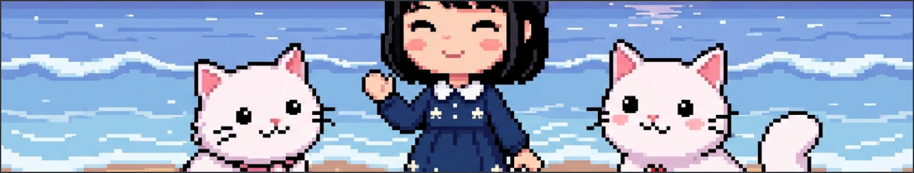
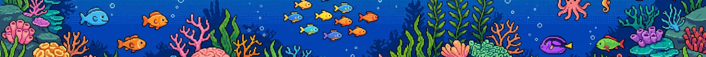

のコテハンです%20🐈%20よろしくお願いします！%20★&fontSize=16&fontColor=FFFF00&fontAlign=50&fontAlignY=55)

 

<!-- 技術スタック -->
<table><tr><td align="center">
<b>🌊 技術スタック 🌊</b>
</td></tr></table>

 

<!-- 統計 -->
<table><tr><td align="center">
<b>📊 統計 ✨</b>
</td></tr></table>

  

 

<!-- 注目プロジェクト -->
<table><tr><td align="center">
<b>🚀 注目プロジェクト 💙</b>
</td></tr></table>

 

